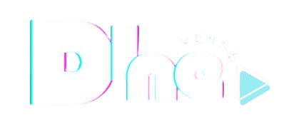
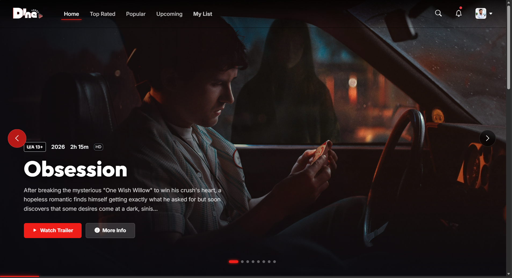

<div align="center">
  
  <h1>🎬 DineVerse Movie Discovery Platform</h1>
  <p>A premium, Netflix-inspired movie streaming interface built with React, Vite, Firebase, and TMDB.</p>

  <!-- Badges -->
  <p>
    
    
    
    
  </p>
</div>

---

## 📖 About The Project

**DineVerse** is a modern, fully responsive web application that replicates the cinematic browsing experience of premium streaming platforms like Netflix. 

It seamlessly integrates live movie data from **The Movie Database (TMDb)**, handles secure user sessions via **Firebase Authentication**, and features highly optimized, bespoke CSS components including hardware-accelerated transform carousels and glassmorphic UI elements.

## ✨ Core Features

### 🔐 Secure Authentication (Firebase)
* **Email & Password:** Native user registration and login flows with robust error handling.
* **Google OAuth:** One-click Google Sign-In integration.
* **Protected Routes:** User-specific dashboards and watchlists are securely protected via React Context API.

### 🎥 Cinematic User Interface
* **Immersive Hero Section:** Dynamically fading background posters of currently trending movies.
* **Glassmorphism:** Premium frosted-glass panels for authentication screens.
* **Dynamic Hover Effects:** Desktop users experience a classic Netflix-style 1.42x card expansion, seamlessly managed with `z-index` stacking to prevent visual clipping.

### 📱 Adaptive Responsiveness
* **Desktop Mode:** Features hardware-accelerated CSS `transform: translateX()` sliders for buttery smooth mouse navigation.
* **Mobile Mode:** Detects smaller viewports (`< 768px`) and completely restructures the DOM to use native, touch-friendly `overflow-x: auto` swiping with strict `scroll-snap` mechanics. Hover effects are intelligently disabled to prevent touch-conflict.

### 🗂️ Data Management & API
* **Live Content:** Categorizes TMDB data into *Trending, Top Rated, Now Playing, and Upcoming*.
* **Custom Fetch Hook:** Utilizes a highly reusable `UseFetch` custom hook for all API calls.
* **Personal Watchlist:** Users can add movies to their "My List" to save them for later viewing.

---

## 🖥️ Demo Preview

 <!-- Update this path if necessary -->

---

## 🛠️ Tech Stack & Architecture

| Layer | Technology |
| --- | --- |
| **Frontend Framework** | React 19 (Hooks, Functional Components) |
| **Build Tool** | Vite (for ultra-fast HMR and optimized builds) |
| **Routing** | React Router DOM v7 |
| **State Management** | Context API (`AuthContext`) |
| **Styling** | Vanilla CSS (BEM naming convention) + Bootstrap 5 Layout Utilities |
| **Backend / Auth** | Firebase Authentication |
| **External API** | The Movie Database (TMDb) API |

---

## 🚀 Getting Started

Follow these instructions to set up the project locally.

### ⚙️ Prerequisites

* **Node.js**: v18.0 or newer.
* **TMDb API Key**: Register for a free API key at [themoviedb.org](https://www.themoviedb.org/).
* **Firebase Project**: Create a project at [firebase.google.com](https://firebase.google.com/) to handle user authentication.

### 🛠️ Installation Steps

1. **Clone the repository:**
   ```bash
   git clone https://github.com/reach2dineshdev/DineVerse.git
   cd DineVerse
   ```

2. **Install all NPM packages:**
   ```bash
   npm install
   ```

3. **Configure Environment Variables:**
   Create a file named `.env` in the root directory. Add your TMDB API key like this:
   ```env
   VITE_API_KEY="your_tmdb_v3_api_key_here"
   ```

4. **Connect to Firebase:**
   Open `src/firebase.js` and replace the `firebaseConfig` object with your own credentials from the Firebase Console.
   > **Note:** Make sure you go into your Firebase Console -> Authentication -> Sign-in Method, and enable both **Email/Password** and **Google**.

5. **Spin up the development server:**
   ```bash
   npm run dev
   ```

6. **View the application:**
   Open `http://localhost:5173` in your browser.

---

## 📁 Project Structure

```text
DineVerse/
├── public/                 # Static assets (logo, favicon)
├── src/
│   ├── Components/         # Reusable UI (Carousels, Cards, Navbar, Footer)
│   ├── Contexts/           # Global State (AuthContext)
│   ├── Hooks/              # Custom Hooks (UseFetch)
│   ├── Pages/              # Route Views (Home, Login, MovieDetails, etc.)
│   ├── Routes/             # React Router DOM configurations
│   ├── Utils/              # Helper functions
│   ├── App.css             # Global Styles & Responsive Media Queries
│   ├── App.jsx             # Main Application Component
│   ├── firebase.js         # Firebase Initialization & Config
│   └── main.jsx            # React DOM Entry Point
├── .env                    # Secret Environment Variables (Not committed)
├── package.json            # Dependencies & Scripts
└── vite.config.js          # Vite Build Configuration
```

---

## 📜 Available Scripts

In the project directory, you can run:

* `npm run dev`: Starts the Vite development server with Hot Module Replacement (HMR).
* `npm run build`: Compiles the application for production into the `dist` folder.
* `npm run preview`: Bootstraps a local static web server to serve the `dist` folder for testing the production build locally.
* `npm run lint`: Runs ESLint to analyze the code for syntax or styling errors.

---

## 🤝 Contributing

Contributions are what make the open source community such an amazing place to learn, inspire, and create. Any contributions you make are **greatly appreciated**.

1. Fork the Project
2. Create your Feature Branch (`git checkout -b feature/AmazingFeature`)
3. Commit your Changes (`git commit -m 'Add some AmazingFeature'`)
4. Push to the Branch (`git push origin feature/AmazingFeature`)
5. Open a Pull Request

---

## 👨‍💻 Author

**Designed & Developed by [Dinesh](https://dinesh-fullstackwebdeveloper.netlify.app/)** 🚀  
Feel free to reach out or connect regarding web development opportunities!
